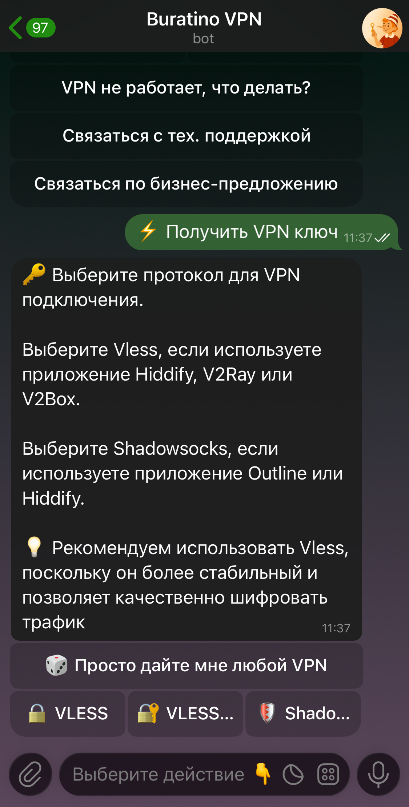
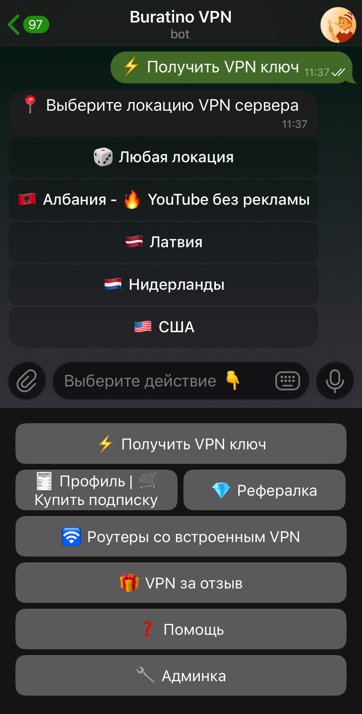
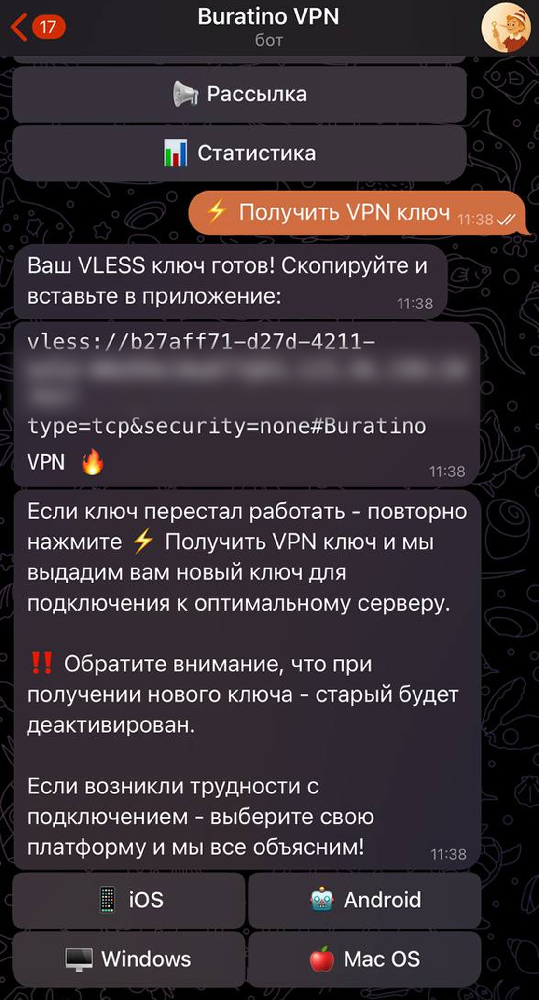

<doc-anchor-target id="computer-установка-vpn-vless-на-macos" class="break-words">
    <h1>
        <doc-anchor-trigger class="header-anchor-trigger" to="#computer-установка-vpn-vless-на-macos">#</doc-anchor-trigger>
    </h1>
</doc-anchor-target>

В этой инструкции мы расскажем, как установить VLESS VPN. Если вы не знаете, что такое VLESS — не переживайте, это просто один из видов VPN, который является быстрым и безопасным

&#x231B; Установка VPN займет всего 2-3 минуты

&#x261D;&#xFE0F; Если что-то не работает — <a href="https://t.me/VPN_Buratino" target="\_blank">напишите нам в поддержку</a>

<doc-anchor-target id="пошаговая-инструкция">
    <h2>
        <doc-anchor-trigger class="header-anchor-trigger" to="#пошаговая-инструкция">#</doc-anchor-trigger>
        Пошаговая инструкция
    </h2>
</doc-anchor-target>
<doc-anchor-target id="1-получить-ключ-доступа">
    <h4>
        <doc-anchor-trigger class="header-anchor-trigger" to="#1-получить-ключ-доступа">#</doc-anchor-trigger>
        1. <strong>Получить ключ доступа</strong>
    </h4>
</doc-anchor-target>

Вам нужен ключ, который выглядит как большая строка со случайными символами и начинается с <code v-pre>vless://</code>. Ключ приходит после оплаты, но его всегда можно заново получить, если есть активная подписка на Buratino VPN

    

    

        

            <svg xmlns="http://www.w3.org/2000/svg" class="mb-px text-callout-primary" width="22" height="22" viewBox="0 0 24 24" role="presentation">
                <g fill="currentColor"><g>
                    <path d="M12 1C5.93 1 1 5.93 1 12s4.93 11 11 11 11-4.93 11-11S18.07 1 12 1zm0 20c-4.96 0-9-4.04-9-9s4.04-9 9-9 9 4.04 9 9-4.04 9-9 9z"></path>
                    <path d="M12 11c-.55 0-1 .45-1 1v4c0 .55.45 1 1 1s1-.45 1-1v-4c0-.55-.45-1-1-1zM12.01 7c-.56 0-1 .45-1 1s.45 1 1 1 1-.45 1-1-.45-1-1-1z"></path>
                    <path fill="none" d="M0 0h24v24H0z"></path>
                </g></g>
            </svg>
        

        

            <h5>Как заново получить ключ доступа?</h5>

Если покупали подписку на сайте, вам пришло письмо на почту — зайдите в Telegram‑бота. Инструкция, как получить ключ через бота, ниже.

Если покупали подписку в Telegram‑боте:

<ol>
<li>Перейдите в Telegram‑бота — <a href="https://t.me/BuratinoVPNbot" target="_blank">перейти</a></li>
<li>Нажмите на кнопку «Получить VPN ключ»</li>
</ol>

<figure class="content-center">
    
    <figcaption class="caption"></figcaption>
</figure>

<ol start="3">
<li>Нажмите на кнопку «&#x1F511; Vless или Vless+reality», далее выберите локацию.</li>
</ol>

<figure class="content-center">
    
    <figcaption class="caption"></figcaption>
</figure>

<ol start="4">
<li>Подтвердите выбор и дождитесь появления готового ключа.</li>
</ol>

<figure class="content-center">
    
    <figcaption class="caption"></figcaption>
</figure>

        

    

<doc-anchor-target id="2-скопировать-ключ-доступа">
    <h4>
        <doc-anchor-trigger class="header-anchor-trigger" to="#2-скопировать-ключ-доступа">#</doc-anchor-trigger>
        3. <strong>Установить приложение v2RayTun</strong>
    </h4>
</doc-anchor-target>

    

        
            <svg xmlns="http://www.w3.org/2000/svg" width="20" height="20" viewBox="0 0 24 24" role="presentation" fill="currentColor"><path d="M4.75 17.25a.75.75 0 0 1 .75.75v2.25c0 .138.112.25.25.25h12.5a.25.25 0 0 0 .25-.25V18a.75.75 0 0 1 1.5 0v2.25A1.75 1.75 0 0 1 18.25 22H5.75A1.75 1.75 0 0 1 4 20.25V18a.75.75 0 0 1 .75-.75Z"/><path d="M5.22 9.97a.749.749 0 0 1 1.06 0l4.97 4.969V2.75a.75.75 0 0 1 1.5 0v12.189l4.97-4.969a.749.749 0 1 1 1.06 1.06l-6.25 6.25a.749.749 0 0 1-1.06 0l-6.25-6.25a.749.749 0 0 1 0-1.06Z"/></svg>
        
        MacOS
    

    

        https://apple.co/4kbeNnX
    

    

<doc-anchor-target id="4-открыть-приложение-v2raytun">
    <h4>
        <doc-anchor-trigger class="header-anchor-trigger" to="#4-открыть-приложение-v2raytun">#</doc-anchor-trigger>
        4. <strong>Открыть приложение v2RayTun</strong>
    </h4>
</doc-anchor-target>

<figure class="content-center">
    
    <figcaption class="caption"></figcaption>
</figure>

<doc-anchor-target id="5-вставить-ключ-в-приложение">
    <h4>
        <doc-anchor-trigger class="header-anchor-trigger" to="#5-вставить-ключ-в-приложение">#</doc-anchor-trigger>
        5. <strong>Вставить ключ в приложение</strong>
    </h4>
</doc-anchor-target>

Нажмите на синюю кнопку «Добавить из буфера» в центре экрана

<figure class="content-center">
    
    <figcaption class="caption"></figcaption>
</figure>

<doc-anchor-target id="6-подтвердить-вставку">
    <h4>
        <doc-anchor-trigger class="header-anchor-trigger" to="#6-подтвердить-вставку">#</doc-anchor-trigger>
        6. <strong>Подтвердить вставку</strong>
    </h4>
</doc-anchor-target>

Нажмите на серую кнопку «Разрешить вставку», ключ вставится автоматически

<figure class="content-center">
    
    <figcaption class="caption"></figcaption>
</figure>

<doc-anchor-target id="7-включить-vpn">
    <h4>
        <doc-anchor-trigger class="header-anchor-trigger" to="#7-включить-vpn">#</doc-anchor-trigger>
        7. <strong>Включить VPN</strong>
    </h4>
</doc-anchor-target>

Вы успешно вставили ключ. Нажмите на синюю кнопку в центре, чтобы включить VPN. После подключения кнопка станет зеленой. Чтобы отключить VPN — нажмите на зеленую кнопку

<figure class="content-left">
    
    <figcaption class="caption caption-float"></figcaption>
</figure>
<figure class="content-center">
    
    <figcaption class="caption"></figcaption>
</figure>

При первом подключении система MacOS попросит разрешение для v2RayTun — подтвердите его

&#x1F389; Готово! VPN подключён и работает

    

    

        

            <svg xmlns="http://www.w3.org/2000/svg" class="mb-px text-callout-warning" width="22" height="22" viewBox="0 0 24 24" role="presentation">
                <g fill="currentColor"><g>
                    <path d="M22.48 15.59L14.01 1.45A2.968 2.968 0 0012.16.09c-.78-.19-1.58-.07-2.27.35-.41.25-.76.6-1.01 1.01v.01L.4 15.6c-.83 1.43-.33 3.27 1.1 4.1.45.26.95.4 1.48.4h16.95c.8-.01 1.55-.33 2.11-.9.56-.57.87-1.33.86-2.13a3.04 3.04 0 00-.42-1.48zm-1.87 2.21c-.19.19-.44.3-.69.3H2.99c-.17 0-.34-.05-.49-.13a.992.992 0 01-.37-1.35L10.6 2.48c.08-.14.2-.25.34-.33a.992.992 0 011.37.33l8.46 14.13c.09.15.13.32.13.49 0 .26-.1.51-.29.7z"></path>
                    <path d="M11.45 12.1c.55 0 1-.45 1-1v-4c0-.55-.45-1-1-1s-1 .45-1 1v4c0 .56.45 1 1 1zM11.46 14.1c-.56 0-1 .45-1 1s.45 1 1 1 1-.45 1-1-.45-1-1-1z"></path>
                </g></g>
            </svg>
        

        

В настоящее время происходят блокировки VPN. Если у вас перестал работать текущий ключ, удалите его и создайте новый ключ в другой стране или с другим протоколом. Иногда VPN начинает работать с 3-5 раза, это нормально

        

    

<doc-anchor-target id="полезная-информация">
    <h2>
        <doc-anchor-trigger class="header-anchor-trigger" to="#полезная-информация">#</doc-anchor-trigger>
        Полезная информация
    </h2>
</doc-anchor-target>

    

        
            <svg xmlns="http://www.w3.org/2000/svg" width="20" height="20" viewBox="0 0 24 24" role="presentation" fill="currentColor"><path d="M23.922 16.992c-.861 1.495-5.859 5.023-11.922 5.023-6.063 0-11.061-3.528-11.922-5.023A.641.641 0 0 1 0 16.736v-2.869a.841.841 0 0 1 .053-.22c.372-.935 1.347-2.292 2.605-2.656.167-.429.414-1.055.644-1.517a10.195 10.195 0 0 1-.052-1.086c0-1.331.282-2.499 1.132-3.368.397-.406.89-.717 1.474-.952 1.399-1.136 3.392-2.093 6.122-2.093 2.731 0 4.767.957 6.166 2.093.584.235 1.077.546 1.474.952.85.869 1.132 2.037 1.132 3.368 0 .368-.014.733-.052 1.086.23.462.477 1.088.644 1.517 1.258.364 2.233 1.721 2.605 2.656a.832.832 0 0 1 .053.22v2.869a.641.641 0 0 1-.078.256ZM12.172 11h-.344a4.323 4.323 0 0 1-.355.508C10.703 12.455 9.555 13 7.965 13c-1.725 0-2.989-.359-3.782-1.259a2.005 2.005 0 0 1-.085-.104L4 11.741v6.585c1.435.779 4.514 2.179 8 2.179 3.486 0 6.565-1.4 8-2.179v-6.585l-.098-.104s-.033.045-.085.104c-.793.9-2.057 1.259-3.782 1.259-1.59 0-2.738-.545-3.508-1.492a4.323 4.323 0 0 1-.355-.508h-.016.016Zm.641-2.935c.136 1.057.403 1.913.878 2.497.442.544 1.134.938 2.344.938 1.573 0 2.292-.337 2.657-.751.384-.435.558-1.15.558-2.361 0-1.14-.243-1.847-.705-2.319-.477-.488-1.319-.862-2.824-1.025-1.487-.161-2.192.138-2.533.529-.269.307-.437.808-.438 1.578v.021c0 .265.021.562.063.893Zm-1.626 0c.042-.331.063-.628.063-.894v-.02c-.001-.77-.169-1.271-.438-1.578-.341-.391-1.046-.69-2.533-.529-1.505.163-2.347.537-2.824 1.025-.462.472-.705 1.179-.705 2.319 0 1.211.175 1.926.558 2.361.365.414 1.084.751 2.657.751 1.21 0 1.902-.394 2.344-.938.475-.584.742-1.44.878-2.497Z"/><path d="M14.5 14.25a1 1 0 0 1 1 1v2a1 1 0 0 1-2 0v-2a1 1 0 0 1 1-1Zm-5 0a1 1 0 0 1 1 1v2a1 1 0 0 1-2 0v-2a1 1 0 0 1 1-1Z"/></svg>
        
        Поддержка
    

    

        https://t.me/VPN_Buratino
    

    

    

        
            <svg xmlns="http://www.w3.org/2000/svg" width="20" height="20" viewBox="0 0 24 24" role="presentation" fill="currentColor"><path d="M10.97 8.265a1.45 1.45 0 0 0-.487.57.75.75 0 0 1-1.341-.67c.2-.402.513-.826.997-1.148C10.627 6.69 11.244 6.5 12 6.5c.658 0 1.369.195 1.934.619a2.45 2.45 0 0 1 1.004 2.006c0 1.033-.513 1.72-1.027 2.215-.19.183-.399.358-.579.508l-.147.123a4.329 4.329 0 0 0-.435.409v1.37a.75.75 0 1 1-1.5 0v-1.473c0-.237.067-.504.247-.736.22-.28.486-.517.718-.714l.183-.153.001-.001c.172-.143.324-.27.47-.412.368-.355.569-.676.569-1.136a.953.953 0 0 0-.404-.806C12.766 8.118 12.384 8 12 8c-.494 0-.814.121-1.03.265ZM13 17a1 1 0 1 1-2 0 1 1 0 0 1 2 0Z"/><path d="M12 1c6.075 0 11 4.925 11 11s-4.925 11-11 11S1 18.075 1 12 5.925 1 12 1ZM2.5 12a9.5 9.5 0 0 0 9.5 9.5 9.5 9.5 0 0 0 9.5-9.5A9.5 9.5 0 0 0 12 2.5 9.5 9.5 0 0 0 2.5 12Z"/></svg>
        
        Часто задаваемые вопросы
    

    

        ../../faq/
    

    

---

🌐 **[Приобрести наш роутер с быстрой доставкой (СДЭК доставка, полностью за наш счёт).](https://resilix.space/)**  

📂 **[Приобрести конфигурацию на свой роутер](https://resilix.space/secure_network)**  

🔑 **[Ключи vless и shadowsocks — V2RayTune \| Hiddify \| Happ](https://t.me/BuratinoVPNbot)**
